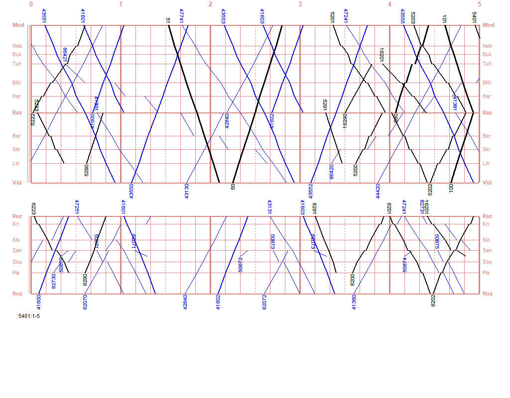
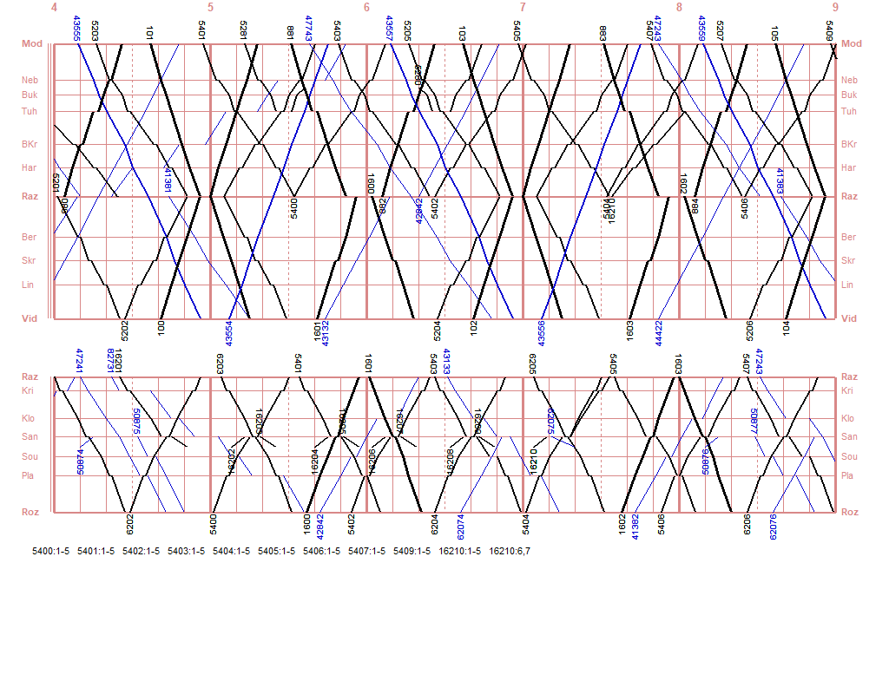
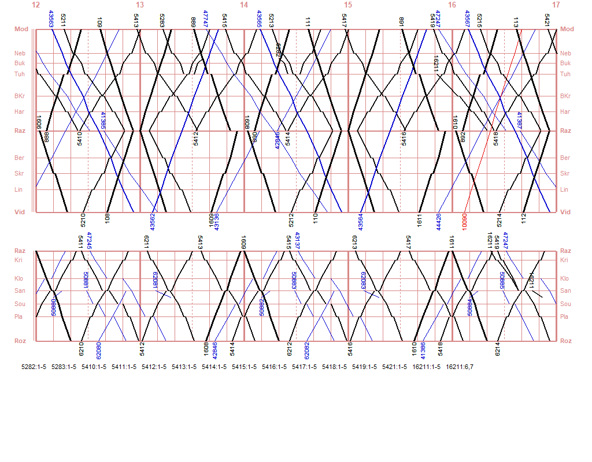

# Projekt Razová

> Alternativní GVD pro Unisim oblast `00` (Modrava - Vidly)

## Stažení


## Instalace

Stáhněte si [archiv se soubory tohoto projektu verze 2.1](https://github.com/katemihalikova/unisim-00-razova/releases/download/v2.1/razova-GVD_00-2.1.zip) a rozbalte jej do složky se simulátorem Unisim verze 1.09. Spusťte soubor `Unisim00.bat` a vyberte oblast `00`.

<details>
<summary><em>Podrobné vysvětlení</em></summary>

Soubory `GVD_00.DAT` a `situ00.txt` z tohoto repozitáře zkopírujte do složky `DATA__00` uvnitř hlavní složky Unisimu.

Tento GVD vyžaduje situační soubor (`situ`). Protože však Unisim situační soubor v oblasti `00` nepodporuje, je potřeba spouštěcí soubor upravit (patchnout). Tím však dojde ke znefunkčnění jiné oblasti, proto takto upravený spouštěcí soubor používejte pouze pro oblast `00` se situačním souborem. Tento upravený (patchnutý) spouštěcí soubor verze 1.09 se nachází v archivu ke stažení, kde se nazývá `Unisim00.exe`, aby nedošlo k záměně s původním spouštěcím souborem (lze provozovat oba vedle sebe, původní pro všechny oblasti kromě `00`).

Pro použití neoriginálního GVD je třeba Unisim spouštět s parametrem `2479`, tedy např. `Unisim00.exe 2479`. Variantně lze jednoduše využít `bat` soubor přiložený v archivu ke stažení.

Úpravu (patchnutí) si také můžete provést sami z originálního souboru `Unisim.exe` verze 1.09 pomocí utility `bspatch` a přiloženého patch souboru spuštěním příkazu:

```sh
bspatch Unisim.exe Unisim00.exe Unisim.exe.109.bspatch
```

</details>

## Schéma oblasti


## Osobní doprava

Ministerstvo dopravy objednává dvě linky: každé dvě hodiny linku **Ex7 Modrava - Vidly**, která projíždí řízenou oblastí po dvojkolejné trati a zastavuje pouze v uzlu Razová, a každé dvě hodiny linku **R42 Modrava - Razová**, která prokládá linku Ex7 na 1h takt v části její trasy.

Krajský úřad pak objednává běžné spoje na třech linkách: každé dvě hodiny linky **L3 Modrava - Vidly** a **L7 Rozmezí - Razová**, které ve stanici Razová váží na Ex7, a dále každé dvě hodiny zrychlenou linku **L37 Rozmezí - Vidly**, která doplňuje R42 na zbylých úsecích.

Na směny do významných podniků v okolí stanic Grimsel a El. Osečná jsou provozovány účelové spoje **L39 Modrava - Grimsel** (vždy 1 pár) a **L79 Šance - El. Osečná** (vždy 5 párů, ráno je první spoj veden Tuhaň - El. Osečná).

Brzy ráno a pozdě v noci je provoz upraven, nejedou Sp vlaky, místo nich jedou Os vlaky, přičemž některé končí ještě v rámci oblasti a na přenocování se Sv jízdou přesouvají do Razové a brzy ráno naopak.

V noci je provozován jeden pár vlaků EuroNight, který mezi Modravou a Vidly nikde nezastavuje.

Číslo | Trasa | Zastavuje | Jede
--- | --- | --- | ---
IC 1xx | Modrava - Vidly | Razová | denně
R 8xx | Modrava - Razová | Tuhaň, Razová (obrat) | denně
MSp 16xx/18xx | Rozmezí - Vidly | Šance, Razová (úvrať), Skřípov | denně
Os 22xx | Modrava - Vidly | všude | denně
MOs 62xx | Rozmezí - Razová | všude | denně
Os 54xx | Modrava - Rozmezí | všude | v ⚒︎
MOs 228x/263xx | Modrava - Grimsel | všude (Tuhaň úvrať) | 6h+18h: denně<br>14h+22h: v ⚒︎
MOs 548x/262xx | (Tuhaň -) Šance - El. Osečná | všude | denně
EN 5x | Modrava - Vidly | nikde | denně

## Nákladní doprava

V průběhu celého dne jsou ve 2h taktu pravidelně vedeny Pn vlaky mezi všemi třemi vstupními body, tedy každou dvojici vstupních bodů spojují Pn vlaky ve 4h taktu. Tyto vlaky dále doplňují kontejnerové Nex vlaky taktéž ve 2h taktu po celý den.

El. Osečná je obsluhována 2h taktem (s občasným vynecháním kvůli provozu Os vlaků) pravidelnými Pn/Vn vlaky ze směru Rozmezí (úvrať ve stanici Šance).

V noci jsou dále v provozu dva páry Nex vlaků Modrava - Rozmezí. Pro místní obsluhu jsou v noci zavedeny dva páry Mn vlaků, Modrava - Lindava a Rozmezí - Razová.

Stanice Grimsel není nákladními vlaky pravidelně obsluhována.

Všechny pravidelné nákladní vlaky jedou denně.

Číslo | Trasa | Takt
--- | --- | ---
Nex 435xx | Modrava - Vidly a zpět | 2h
Nex 416xx | Modrava - Rozmezí a zpět | 2 páry
Pn 477xx | Modrava - Vidly | 4h
Pn 444xx | Vidly - Modrava | 4h
Pn 413xx | Rozmezí - Vidly | 4h
Pn 431xx | Vidly - Rozmezí | 4h
Pn 472xx | Modrava - Rozmezí | 4h
Pn 428xx | Rozmezí - Modrava | 4h
Pn 620xx | Rozmezí - El. Osečná | 2h neúplný
Vn 508xx | El. Osečná - Rozmezí | 2h neúplný
Mn 864xx | Modrava - Lindava a zpět | 1 pár
Mn 827xx | Rozmezí - Razová a zpět | 1 pár

Mimořádné vlaky jsou zaváděny v případě potřeby. Pouze tyto vlaky mohou vyžadovat nácestnou prohlídku, střídání na ose nebo přidání postrku. Všechny mimořádné vlaky mají čísla 9xxxx. K dispozici jsou 4 postrkové lokomotivy ve stanici Tuhaň a 2 postrkové lokomotivy ve stanici Nebákov. V případě nouze lze také využít operativní zálohu v Razové.

## Poznámky o organizaci provozu

### Razová

* Do uzlu L:00 je zapojeno pět vlaků s přepravou cestujících, přičemž stanice disponuje pouze pěti kolejemi s nástupištěm, pozor na případné obsazení koleje s nástupištěm nákladním vlakem
* Lokomotiva od vlaku R 8xx čeká 2 hodiny na další spoj, souprava však točí zpět po pouhých 14 minutách, přizpůsobte tomu využití kolejí ve stanici, např. čekající lokomotivu mějte připravenou na koleji 4a a přijíždějící rychlík pošlete na kolej 4, kam může čekající lokomotiva ihned přijet
* Provoz kolem 0:00 (půlnoc):
  * Souprava i lokomotiva od posledního R 8xx pokračují jako Os do Lindavy a pak se vrací Sv do Razové
  * Os z Rozmezí jede z Razové zpět do Plání a pak se vrací Sv do Razové
  * Os z Vidlí pokračuje dále do Modravy
* Provoz kolem 4:00:
  * Souprava i lokomotiva pro první R 8xx jedou Sv do Lindavy, odkud se vrací jako Os do Razové, odkud pokračuje již běžně jako R do Modravy
  * Souprava od večerního Os z Plání jede opět Sv do Plání, odkud se vrací jako Os do Razové, odkud pokračuje již běžně jako Os do Rozmezí
  * Os z Modravy pokračuje dále do Vidlí
  * Souprava pro účelové spoje do El. Osečná jede Sv do Tuhaně, odkud se vrací jako Os přes Razovou přímo do El. Osečná
* Soupravy od osobních vlaků lze odstavit společně na kolej 5b, soupravu od rychlíku na vhodnou staniční kolej

### Šance

* V pracovní dny se v době jízdy účelových spojů (cca 16:40, 17:15, 17:50, 18:10, 18:40 a 19:15) ve stanici nachází tři vlaky s přepravou cestujících, dejte pozor, aby nedošlo k ohrožení nástupu a výstupu cestujících
* Pro odstavení soupravy účelových spojů použijte kolej 2d

## Výluky
* [Scénář výluky trati v úseku Razová - Šance](./V%C3%BDluka%20Razov%C3%A1%20-%20%C5%A0ance.md)

## Nedostatky simulátoru

* Pokud začínáte simulaci hrát v 6 hodin, je třeba urychleně naposunovat a přivěsit lokomotivu k vlaku 882; v ostatních sudých hodinách (4, 8-22) je lokomotiva již přivěšena

## Seznam změn

* v2.1
  * Přidán dokument [Scénář výluky trati v úseku Razová - Šance](./V%C3%BDluka%20Razov%C3%A1%20-%20%C5%A0ance.md), pomocí kterého je možné si nasimulovat denní či dlouhodobou výluku tohoto úseku bez nutnosti měnit soubor GVD
  * Os 5419: zrušeno zbytečné čekání ve výh. Souš
  * Opravena chybějící lokomotiva při startu hry v 6:00 (nedostatek simulátoru)
  * Opraveno seřazení vlaků v souboru s GVD
* v2.0
  * Přidány vložené Os 54xx Modrava - Rozmezí jedoucí v přibližném 1h taktu s vynecháním v sedle
  * Křižování 6201 × 6202 přesunuto do Rozmezí drobnou úpravou časových poloh
  * Okrajové R 880 a 899 nově zastavují také v Bílém Kříži a Nebákově
  * Účelové spoje do El. Osečná jsou rozšířeny na 5 párů, přičemž návoz z Rozmezí byl zrušen (nahrazen Os 54xx); souprava mezi ranním a večerním provozem čeká ve stanici Šance, po večerním provozu pak jede Sv nocovat do Razové, ráno jede Sv do Tuhaně, odkud jede jako Os až do El. Osečná
  * Pravidelné nákladní vlaky na trati Razová - Rozmezí byly mírně přesunuty do nových časových poloh
  * Přidán situační soubor (`situ`), aby simulace probíhala správně již od spuštění

## Nákresný jízdní řád









## Autorka

[Kate Miháliková](https://katemihalikova.cz/)
